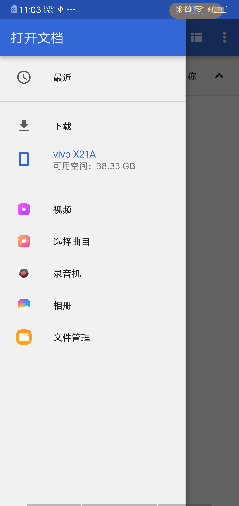
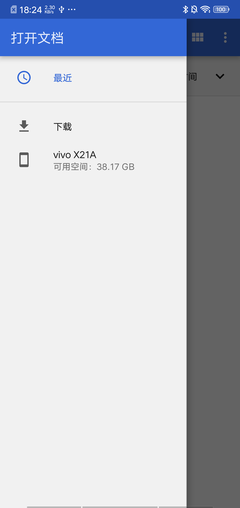

# Android浏览文件
>记一次文件上传引发的血案

------

###### 前情描述：
使用系统文件管理器，选择指定文件类型上传。

##### 基础知识
* MIME
* 调起文件管理器
* 指定浏览位置(路径转URI)
* 设置多种文件类型
* URI转路径

##### 踩坑
* com.tencent.mtt.fileprovider 问题

### 1. MIME
> MIME (Multipurpose Internet Mail Extensions) 是描述消息内容类型的因特网标准。

```
final String DOC = "application/msword";
final String XLS = "application/vnd.ms-excel";
final String PPT = "application/vnd.ms-powerpoint";
final String DOCX = "application/vnd.openxmlformats-officedocument.wordprocessingml.document";
final String XLSX = "application/x-excel";
final String XLSX = "application/vnd.openxmlformats-officedocument.spreadsheetml.sheet";
final String PPTX = "application/vnd.openxmlformats-officedocument.presentationml.presentation";
final String PDF = "application/pdf";
final String MP4 = "video/mp4";
final String M3U8 = "application/x-mpegURL";
```

更多文件类型，自行百度

### 2. 调起文件管理器

1. 所有类型文件 

    ```
    Intent intent = new Intent(Intent.ACTION_GET_CONTENT);
    //任意类型文件
    intent.setType("*/*");
    intent.addCategory(Intent.CATEGORY_OPENABLE);
    startActivityForResult(intent,1);
    
    
    //-------常用类型
        //图片
    //intent.setType(“image/*”);
        //音频
    //intent.setType(“audio/*”);
        //视频
    //intent.setType(“video/*”); 
    //intent.setType(“video/*;image/*”);
    ```

2. 系统的相冊
        
    ```
     Intent intent= new Intent(Intent.ACTION_PICK, null);
     intent.setDataAndType(MediaStore.Images.Media.EXTERNAL_CONTENT_URI, "image/*");
     startActivityForResult(intent, REQUEST_CODE_FILE); 
    ```

### 3. 指定浏览位置(路径转URI)
>跳转到指定路径下，涉及到将路径转为URI，考虑Android版本区别

```
/**
 * file --> uri
 * @param context
 * @param file
 *
 * @return
 */
public static Uri getUriFromFile(Context context, File file) {
    if (context == null || file == null) {
        throw new NullPointerException();
    }
    Uri uri;
    if (Build.VERSION.SDK_INT >= Build.VERSION_CODES.N) {
        uri = FileProvider.getUriForFile(context.getApplicationContext(), BuildConfig.APPLICATION_ID + ".fileprovider", file);
    } else {
        uri = Uri.fromFile(file);
    }
    return uri;
}
```
由于7.0的升级还需要在```AndroidManifest.xml```中配置FileProvider

```
<provider
    android:name="android.support.v4.content.FileProvider"
    android:authorities="${applicationId}.fileprovider"
    android:exported="false"
    android:grantUriPermissions="true">
    <meta-data
        android:name="android.support.FILE_PROVIDER_PATHS"
        android:resource="@xml/file_paths" />
</provider>
```

```${applicationId}.fileprovider```这个配置要记牢，后期遇到大坑就靠这个值了。


```xml/file_paths``` 文件如下:

[参考CSDN](https://blog.csdn.net/chxc_yy/article/details/81536875)
```
<!--物理路径相当于Context.getFilesDir() + /path/-->
<files-path name="name" path="path" />

 <!--物理路径相当于Context.getCacheDir() + /path/-->
<cache-path name="name" path="path" /> 
 <!-- 物理路径相当于Environment.getExternalStorageDirectory() + /path/-->
<external-path name="name" path="path" />
 <!-- 物理路径相当于Context.getExternalFilesDir(String) + /path/-->
<external-files-path name="name" path="path" />
 <!-- 物理路径相当于Context.getExternalCacheDir() + /path/-->
<external-cache-path name="name" path="path" />
```

将文件路径转(*_使用微信下载目录做测试_*)为URI后，设置到Intent中。

```
/**
 * 根据类型，加载文件选择器
 */
private void chooseFileWithPath() {
    Intent intent = new Intent(Intent.ACTION_GET_CONTENT);
    intent.addCategory(Intent.CATEGORY_OPENABLE);

    //跳转指定路径，如果路径不存在，切到sdcard
    //需要读权限
    String path = getSDPath();
    if (!TextUtils.isEmpty(path)) {
        //使用微信下载目录测试
        path = path + File.separator + "tencent/MicroMsg/Download";
        File file = new File(path);
        if (file.exists()) {
            //主要代码
            intent.setDataAndType(FileUtil.getUriFromFile(this, new File(path)), "*/*");
        } else {
            intent.setType("*/*");
        }
    } else {
        intent.setType("*/*");
    }
    startActivityForResult(intent, REQUEST_CODE_FILE);
}
```
主要生效代码：

```
Intent intent = new Intent(action,uri);
intent.setType("*/*");
startActivityForResult(intent, REQUEST_CODE_FILE);
```
或者

```
Intent intent = new Intent(action);
intent.setDataAndType(uri, "*/*");
startActivityForResult(intent, REQUEST_CODE_FILE);
```

### 4. 设置多种文件类型
通过```intent.setType()```方式设置的文件类型，只能生效一次，所以如果想只选择```doc、excel、pdt、ppt```等办公文档，过滤掉其他文件，就不能使用```intent
.setType()```方式，而是使用```Intent.EXTRA_MIME_TYPES```来传值。

```

final String DOC = "application/msword";
final String XLS = "application/vnd.ms-excel";
final String PPT = "application/vnd.ms-powerpoint";
final String DOCX = "application/vnd.openxmlformats-officedocument.wordprocessingml.document";
final String XLSX = "application/x-excel";
final String XLSX = "application/vnd.openxmlformats-officedocument.spreadsheetml.sheet";
final String PPTX = "application/vnd.openxmlformats-officedocument.presentationml.presentation";
final String PDF = "application/pdf";

/**
 * 多种文件类型
*/
private void chooseMoreTypes() {
    Intent intent = new Intent(Intent.ACTION_GET_CONTENT);
    intent.addCategory(Intent.CATEGORY_OPENABLE);
    String[] mimeTypes = {DOC, DOCX, PDF, PPT, PPTX, XLS, XLS1, XLSX};
    intent.setType("application/*");
    
    intent.putExtra(Intent.EXTRA_MIME_TYPES, mimeTypes);
    startActivityForResult(intent, REQUEST_CODE_FILE);
}
```

以上是准备工作，调起文件管理器进行选择文件，对于一个Android开发者来说，以上步骤只是相当于一小步，不要忘记**适配**。

接下来才是长征路。

### 5. URI转路径
> 在这一步主要解决的是将返回的URI转换为File，大坑也往往就在这一步出现。

从网上能找到File转File的代码，但是百度出来的内容，10篇有8篇是一样的，剩下2篇不能看。

但是这8篇中几乎都是相同的，没有解决一个至关重要的问题**QQ文件管理器**。

也可能是不会用搜索引擎吧。

上代码
```
/**
 * 专为Android4.4设计的从Uri获取文件绝对路径，以前的方法已不好使
 */
@RequiresApi(api = Build.VERSION_CODES.KITKAT)
public static String getPath(final Context context, final Uri uri) {

    final boolean isKitKat = Build.VERSION.SDK_INT >= Build.VERSION_CODES.KITKAT;
    if (isKitKat && DocumentsContract.isDocumentUri(context, uri)) {
        
        //一些三方的文件浏览器会进入到这个方法中，例如ES
        //QQ文件管理器不在此列
        
        if (isExternalStorageDocument(uri)) {
            final String docId = DocumentsContract.getDocumentId(uri);
            final String[] split = docId.split(":");
            final String type = split[0];
            if ("primary".equalsIgnoreCase(type)) {
                return Environment.getExternalStorageDirectory() + "/" + split[1];
            }
        }
        // DownloadsProvider
        else if (isDownloadsDocument(uri)) {
        ...
        }
        // MediaProvider
        else if (isMediaDocument(uri)) {
        ...
        }
    } else if ("content".equalsIgnoreCase(uri.getScheme())) {// MediaStore (and general)
        return getDataColumn(context, uri, null, null);
    } else if ("file".equalsIgnoreCase(uri.getScheme())) {// File
        ...
    }
    return null;
}
```
发现部手机会有第三方的文件管理器，如ES，QQ等_目前只接触到这两种，不排除其他APP_，相信大部分都是好同志，但不限于鹅厂大佬。

通过QQ浏览器选择到的文件，则会报出*不存在_data字段*这个错误。

*WTF*

*懵逼.jpg*

返回的URI中```uri.getAuthority()```的值并不是自己在Manifest.xml中设置的**${applicationId}.fileprovider**而是**com.tencent.mtt.fileprovider**。

这时候，前面搜索到的文章，几乎都没有解决这个问题。

鉴于水平有限，被坑了半天后。

通过分析```uri.getPath();```的值。

写下来如下代码，如各位大佬有更好的解决方案，望转告。

```
//判断QQ文件管理器
if (isQQMediaDocument(uri)) {
    String path = uri.getPath();
    File fileDir = Environment.getExternalStorageDirectory();
    File file = new File(fileDir, path.substring("/QQBrowser".length(), path.length()));
    return file.exists() ? file.toString() : null;
}
```
测试通过机型: 魅族15，三星9300，mi6，oppoR9, 华为mate9


缺失代码自行补齐，
主要类代码[FileUtil](app/src/main/java/cn/dbboy/filechoose/FileUtil.java)

-----

#### 其他问题

1. 文件类型设置

产品需求：
 
 ```
 ╔══════════════════════════════
 ║
 ║   上传文件       上传视频
 ║
 ╚══════════════════════════════
 ```
 
 要求: 1. 点击视频选择mp4，2. 点击文件选择pdf、word等office文件。
 
在设置Intent的时候分为2种：
    
   * ```intent.setType("*/*")```
    
    
        这种情况下，本意是想选择office文档。通过```Intent.EXTRA_MIME_TYPES```来限制文件类型，但是这种情况下，会出现第三方的文件管理器，而三方的一些情况下不会生效，所有文件都可以选择。
        
        我做的是，通过观察MIME类型，我设置的是```application/*```第三方的文件管理图标隐藏掉了，只能通过系统的文件管理选择文件。
        
        {:height="400" width="300"}
        {:height="400" width="300"}
        
   * ```intent.setType("video/mp4);```
   
    1. 这种会显示三方文件管理器，但是会过滤掉其他的文件，只有video类型的，如果有avi类型，那么还需要在```onActivityResult```中判断文件后缀名。
    2. 系统的文件管理器会生效，只能选择```Intent.EXTRA_MIME_TYPES```设置的类型
    

